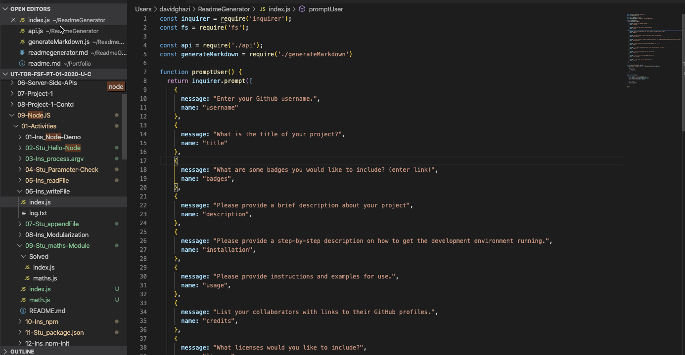

# Unit 09 Node.js and ES6+ Homework: Good README Generator

## Built a Readme Generator

## Description

This project will ask a series of questions awaiting the response from the user. Based on the response, a good readme.md file will be created for your project.

## User Story

    AS A developer
    I WANT a README generator
    SO THAT I can easily put together a good README for a new project

## Criteria

    GIVEN the developer has a GitHub profile and a repository

    WHEN prompted for the developer's GitHub username and repo specific information
    THEN a README for the repo is generated
    
## Requirements

- Functional, deployed application.
- GitHub repository with a unique name and a README describing project.
- The generated README includes a bio image from the user's GitHub profile.
- The generated README includes the following sections:

  - Title
  - Description
  - Table of Contents
  - Installation
  - Usage
  - License
  - Contributing
  - Tests

- The generated README includes 1 badge that's specific to the repository.

## APP Functionality

